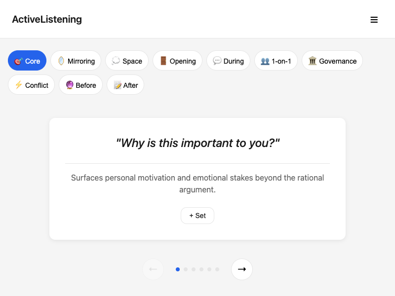
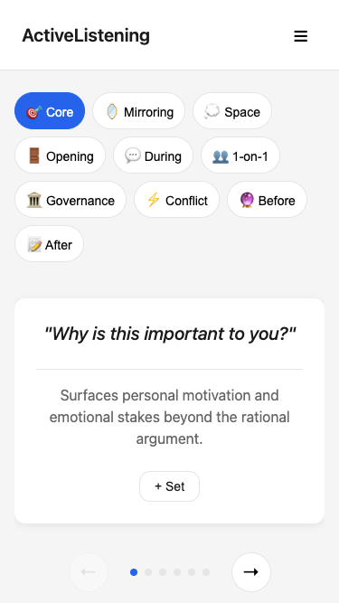
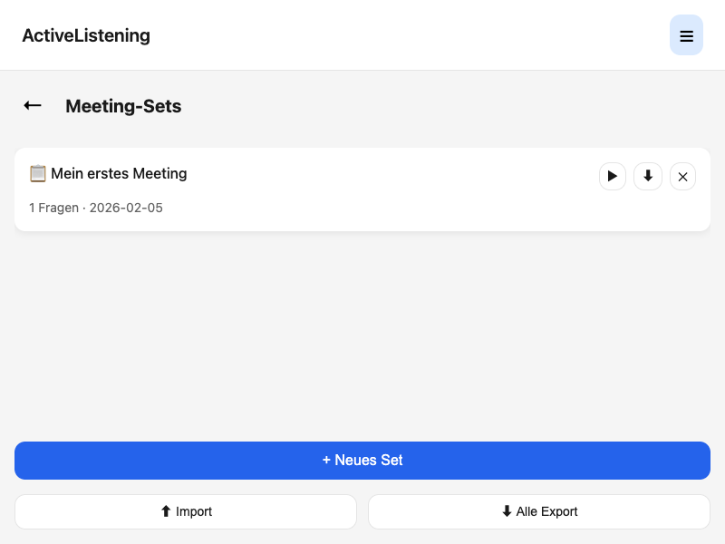
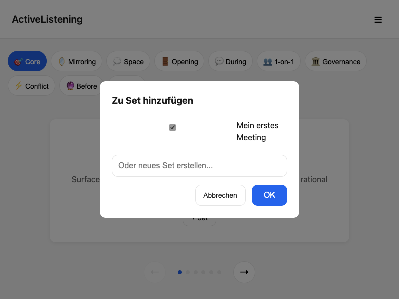

# ActiveListening

Eine minimalistische Web-App für kontextbezogene Meeting-Fragen. Basierend auf dem Prinzip:

> **Ask one question. Then wait. Silence is data.**

🇬🇧 [English Version](README.md)

## Demo

**[Live Demo](https://dkd-dobberkau.github.io/ActiveListening/)**

## Screenshots

### Kartenansicht


### Mobile Ansicht


### Meeting-Sets verwalten


### Frage zu Set hinzufügen


## Features

- **10 Kategorien** mit 43 kuratierten Fragen für effektives Zuhören
- **Kartenansicht** mit Swipe-Gesten und Keyboard-Navigation
- **Meeting-Sets** erstellen, speichern und wiederverwenden
- **Export/Import** von Sets als JSON
- **Offline-fähig** - funktioniert ohne Internetverbindung
- **Responsive Design** - optimiert für Desktop und Mobile

## Kategorien

| Kategorie | Beschreibung |
|-----------|--------------|
| 🎯 Core | Fragen zum Kern des Themas |
| 🪞 Mirroring | Spiegeln und Vertiefen |
| 💭 Space | Raum schaffen für Reflexion |
| 🚪 Opening | Meeting-Eröffnung |
| 💬 During | Während der Diskussion |
| 👥 1-on-1 | Einzelgespräche |
| 🏛️ Governance | Community & Governance |
| ⚡ Conflict | Konflikte navigieren |
| 🔮 Before | Selbst-Check vorher |
| 📝 After | Selbst-Check nachher |

## Technologie

- **Vanilla JavaScript** (ES6 Modules)
- **Kein Build-Step** - direkt im Browser ausführbar
- **LocalStorage** für Persistenz
- **CSS3** mit Flexbox und Animationen

## Installation

Keine Installation nötig. Einfach klonen und öffnen:

```bash
git clone https://github.com/dkd-dobberkau/ActiveListening.git
cd ActiveListening

# Option 1: Direkt öffnen
open index.html

# Option 2: Lokaler Server
python3 -m http.server 8080
# Öffne http://localhost:8080
```

## Verwendung

1. **Kategorie wählen** - Klicke auf einen oder mehrere Chips
2. **Fragen durchblättern** - Swipe oder Pfeiltasten
3. **Zum Set hinzufügen** - Klicke "+ Set" auf einer Frage
4. **Sets verwalten** - Klicke ☰ oben rechts

## Lizenz

[MIT](LICENSE)

## Credits

Entwickelt für [dkd Internet Service GmbH](https://www.dkd.de)
